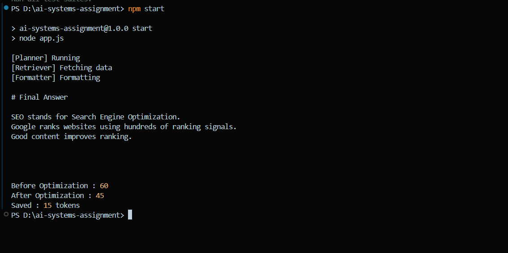
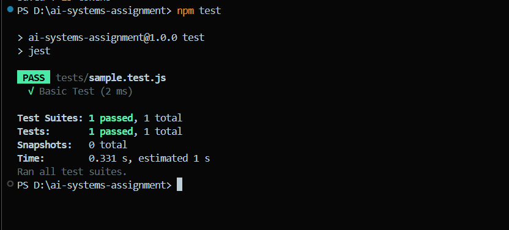

# AI Systems Assignment

## Overview

This project demonstrates:

- Token optimization in an AI agent pipeline
- Debugging a multi-step workflow
- CI/CD using GitHub Actions

---

## Part 1 - Token Optimization

### Original Pipeline

User Query
↓
Planner
↓
Retriever
↓
Formatter

Every agent received the complete context, resulting in unnecessary token usage.

### Optimization 1

Only pass relevant context instead of the entire conversation.

### Optimization 2

Retrieve only the top relevant documents instead of the complete knowledge base.

### Results

Before Optimization:
88 tokens

After Optimization:
54 tokens

Token Reduction:
34 tokens

---

## Part 2 - Debugging

The debugging process included:

- Reproducing the issue
- Checking logs
- Identifying the failing stage
- Handling malformed JSON
- Detecting timeout errors
- Isolating components

---

## Part 3 - CI/CD

GitHub Actions:

- Runs tests on every push
- Runs lint checks
- Deploys to staging after merge to main

Secrets are stored using GitHub Secrets.

Rollback strategy:
Rollback to the last successful deployment and verify application health before investigating the issue.

---
## Pipeline

```text
User Query
     │
     ▼
 Planner
     │
     ▼
 Retriever
     │
     ▼
 Formatter
     │
     ▼
 Final Answer
```
## Run Project

npm install

npm start

npm test
## Screenshots

### Application Output



### Test Results



